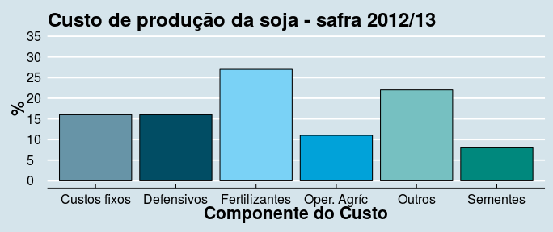
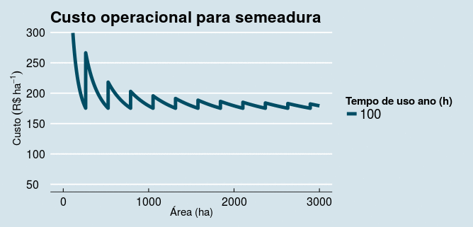

# Operações agrícolas
As operações mecanizadas visam a melhoria dos sistemas de produção,
preconizando a agilidade e a qualidade dos processos, tendo como um dos
limitadores o orçamento financeiro da empresa. Os custos das operações
mecanizadas na cultura soja são de aproxidamente 11,00% 

 

Fonte (IMEA, 2012)

--- 

## Planejamento

Quanto mais complexo o sistema mecanizado, maior é a interferência da gerência
para manter a integração entre o cronograma exigido e os recursos
financeiros. A compreensão dos aspectos operacionais e econômicos pode 
elevar a eficiência e a lucratividade do sistema. 

---

## Tomada de decisão

No planejamento dos sistemas mecanizados, seja na aquisição ou substituição da
maquinaria agrícola, entre os fatores que influenciam na tomada de decisão,
cita-se a intenção da minimização do custo das operações, aumento da
capacidade de campo e a implementação de novas técnicas. 

---  &radio
## Qual a melhor opção para obter informações para tomada de decisão?

1. Cálculos rápidos utilizando poucos dados.
2. "Achismo". 
3. _Realizar simulações para verificar o comportamento do custo da operação._
4. n.d.a.

*** .hint 
Criar diferentes cenários 

*** .explanation 
A simulação de cenários permite verificar qual o conjunto que melhor atende as
suas condições. 

--- 

## Software AGCOM

Um modo de simular os custos é a utilização de softwares, pois o processo de
realização dos cálculos para simulação dos cenários torna-se mais prático. O
**AGCOM** é um software de uso livre que visa à predição dos 
custos nas operações de semeadura, pulverização e colheita para as culturas de
soja e milho.

*Simulação do custo operacional para um conjunto com CcO de 2,63 ha h^-1^.*

---

# Para acessar o **AGCOM** 

## Opção 1
Acesse o link
[AGCOM Modulo Colhedora](https://agcom.shinyapps.io/DEVELOP_DATA_PROD/). Esta
opção trata-se de um versão on-line simplificada software **AGCOM**, sendo possível
estimar o custo operacional da operação de colheita com algumas restrições para
alterar a entrada de dados, como por exemplo a eficiência operacional, valor de
sucata da máquina, etc.

## Opção 2
Acesse o link
[Software AGCOM](https://sites.google.com/site/com4agriculture/software-agcom). Neste
site é possível acessar o software e um guia de uso. 

---

## Agradecimentos

    

 

  

---
# **Contato**

## [Acesse o site](https://sites.google.com/site/com4agriculture/)

## [Acesse o blog](https://sistemasagricolas.wordpress.com/)

## [Research Gate](http://www.researchgate.net/profile/Rafael_Tieppo)

## [Curta no Facebook](https://www.facebook.com/com4agriculture#)

## [https://twitter.com/rafatieppo](http://www.researchgate.net/profile/Rafael_Tieppo)

##
##

## *Obrigado pelo tempo despendido!*

